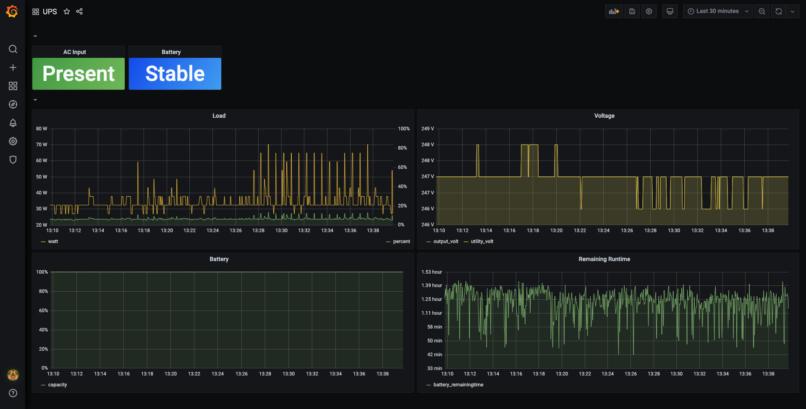

# pwrstat-http

Exports CyberPower UPS tool as an HTTP service.

Also comes with an out-of-the-box demo setup with data collection (Telegraf), storage (InfluxDB 2) and dashboard (Grafana).



# Requirements

* Docker
    * The container does not need to be privileged.
    * If you are using Podman or Rootless Docker, make sure they have write access to your UPS device (usually `/dev/usb/hiddev0`).
* Linux x86_64 host
    * CyberPower tools (pwrstat) is only available under x86.
    * This tool only supports Linux host.
    * The Dockerfile assumes x86_64.

# Usage

## Start the service

### With docker-compose (recommended)

This launches pwrstat-http server (:3000) + Telegraf + InfluxDB 2 + Grafana (:3001).

```sh
$ git clone https://github.com/SEIAROTg/pwrstat-http.git
$ cd pwrstat-http
$ docker-compose up -d
```

### With docker

This only launches pwrstat-http server (:3000).

```sh
$ git clone https://github.com/SEIAROTg/pwrstat-http.git
$ docker build -t pwrstat-http pwrstat-http
$ docker run \
    -d
    --device /dev/usb/hiddev0 \
    -e HTTP_HOST=0.0.0.0 \
    -e HTTP_PORT=3000 \
    -p 3000:3000 \
    pwrstat-http
```


## Access the service

```sh
$ curl http://localhost:3000/status
{"timestamp": 1600000000000000000, "state": 0, "model_name": "CP900EPFCLCD", "firmware_num": "000000000000", "battery_volt": 24000, "input_rating_volt": 230000, "output_rating_watt": 540000, "avr_supported": true, "online_type": false, "diagnostic_result": 6, "power_event_result": 0, "battery_remainingtime": 4500, "battery_charging": false, "battery_discharging": false, "ac_present": true, "boost": false, "utility_volt": 230000, "output_volt": 230000, "load": 10000, "battery_capacity": 100}
```
